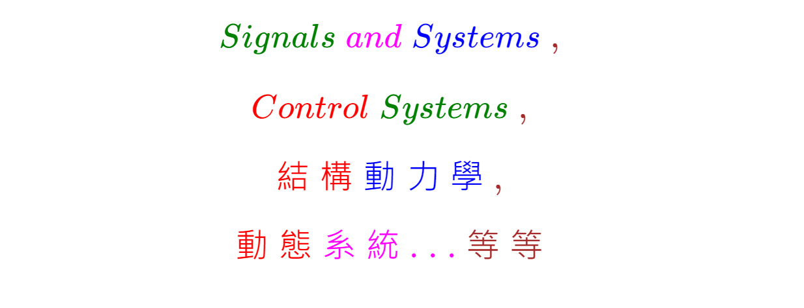

<!--     C:\2302\github\Docs_2E       -->

### 
<!--                 
# \[{  \color{Fuchsia}精\;銳\; \color{Purple}矩\;陣\;  \color{Red}計\;算\; \color{Green} 求\;解\;器  }\] 
-->  
 

<!--         
#### \[{  \color{Fuchsia} 【 \color{Green}  Sharp \; Matrix \; Solver \;  \color{Brown} \iff  \;  \color{Red} S\;M\;S】 }\]  
-->  
  

##  

<!--   
###### \[{ \color{Red} {從\;微\; {\color{Brown}分\; {\color{Fuchsia}方\; {程\; \color{Green} {式\; { \color{Blue} 起\; \quad \Rightarrow}  }  }  }  }  }  }\] 
### \[{  \color{Red} 經\;由\;系\;統\; \color{Blue}矩\; 陣\quad \color{Green} \Rightarrow }\] 
# \[{  \color{Brown} 求\;得\; \color{Red}系\;統\; \color{Green}響\;應\;值\quad \color{Brown} \oplus   }\]
-->
######  
  

<!--   
# \[{  \color{Purple}Computational \quad \color{Fuchsia}Matrix  }\] 
-->   
  

<!--    
######  \[{ \color{Blue} for }\]
-->
  

<!--     
### \[{  \color{Green} Signals \; \color{Fuchsia} and \; \color{Blue} Systems \; \color{Brown},   }\]
### \[{   \color{Red} Control \; \color{Green} Systems \; \color{Brown} ,  }\]
### \[{   \color{Red} 結 \; 構 \; \color{Blue} 動 \; 力 \;  學 \; \color{Brown},  }\]
### \[{   \color{Red} 動 \; 態 \; \color{Fuchsia} 系 \; 統 \; .\;.\;. \color{Brown} \; 等 \; 等  }\]
-->
  

<!--      
### \[{  \color{Green} 參\;見\; \color{Gold}本\;儲\;存\;庫\; \color{Blue} 的\;程\;式\;碼 \color{Brown}。 }\]
##  
## \[{  \color{Olive} AI人工智慧 \color{Coral} 與 \color{#E9EAEC} 物理、機電實驗的\color{#FFDF00}響應  }\]  
-->
  

<!--       
######  \[{  \color{Cyan}使\;用\;以   }\]  
-->
  

<!--    
### \[{  \color{Teal} System-Driven(系統驅動)   }\]  
### \[{  \color{Maroon} Engineering \; \color{Chocolate} and \; \color{Khaki} Science \;  \color{Indigo} Computation  }\]  
### \[{  \color{Magenta} 工程和科學 \color{Chocolate}計算   }\]  
-->
  

###  

<!--    
####  \[{  \color{Teal} *\;*\;*\;*\;*\;*\;*\;*\;*\;*\;*\;*\;*\;*\;*\;*\;*\;* }\]  
-->
  

##

##### **看了Youtube【科學史沙龍】**   

### [蔡教授的演講，虛幻乎？真實乎？-談虛數的幻與真。](https://www.youtube.com/watch?v=n9cMg0e8KBw)  

##### **我非常同意這句話，在數學世界裡，有古典名言【連結實數世界裡兩個真理的最短路徑，是通過虛數】，並非科幻之談。但不知是否改爲【實數的數值計算過程中，若無法使用實數值來表示數值，必須改爲複數值來表達，再繼續使用複數矩陣計算，複數矩陣計算的最後結果，仍然是複數矩陣，但我發現此複數矩陣的虛數值為零，故可去掉零的虛數值，最後又回到實數矩陣的世界，故我的結論是【實數值是真實的數值，複數值僅是中間必要的計算過程而已，最後計算結果都應該回到實數的真實世界中】。這是我使用C#程式語言撰寫矩陣計算，以常微分方程式的齊次解，求得複數特徵值與複數特徵向量，無意中發現的結果，連我自己也表示驚訝！但我不知道是否正確？也需要更多的同好、專家、學者的評論，故在此請益、多多指教。** 

##### **直接使用單一個的複數做計算，我個人認爲可能有問題？但大家都是這樣作。僅單單一個複數值，我們並不知道是代表什麽意思。應該是由微分方程式，得到系統矩陣，再得到複數的特徵值與特徵向量矩陣，最後求得系統的響應值。一般訊號與系統的書，都是直接使用複數，虛數值就是頻率，作所謂的Fourier、Laplace和Z轉換等等。空間維度(Space Dimension)僅有一個自由度(Degree of Freedon)，狀態維度(State Dimension)可以有多個自由度，似乎較容易求解，但若是空間與狀態維度有多個自由度時，需要使用矩陣的數學模型計算，就如上所述的由微分方程式求得到系統矩陣，再求得整個系統隨著時間(t)變化的響應值，可參見本儲存庫(Repository)相關的程式碼。**  

##### **我這樣的發現，是依據矩陣的計算理論，使用C#程式語言撰寫矩陣的計算所發現的結果。譬如求解多項式的根，將多項式轉爲矩陣的形式，發現多項式的根，就是矩陣的特徵值，在計算的過程中，無法使用實數求得多項式的根，必需轉爲複數才可求得。另外對於【非對稱實數矩陣】的特徵值和特徵向量，也是無法使用實數值求得，必需轉爲為複數，使用複數矩陣的計算，計算包含複數矩陣的加、減、乘、除、轉置、求逆、合並等等，雖然最後複數矩陣的計算結果也是複數矩陣，我也發現該複數矩陣的虛數值為零，即複數矩陣可轉爲實數的矩陣，計算的最後結果又回到實數的矩陣，回到實數的真實世界中，不再包含虛數值。故【複數矩陣實際的計算，並不是一般純理論的推導】，這個部分即使是數學家可能也無法想像、或是無法做到的事情，以至對於虛數值產生困惑。**  

##### **我將研究的結果，包含動態系統公式的推導、C#程式的撰寫，並發佈於Github網站上。**

## [矩 陣 計 算 求 解 器](https://github.com/myyeh2/) 

#### ***在網路上，常常有人提到矩陣的對角線化，但我不知是否有人？實際以程式碼去實作，對於【實數正方形非對稱矩陣】的對角化，實際上是永遠無法產生上三角型矩陣【Upper Triangular Diagonal Matrix】，這時產生的矩陣稱為【Qusi-Sub-Diagonal Matrix】，這是非常關鍵的重要型態矩陣，Qusi-Sub-Diagonal Matrix暫時稱爲【Ye Matrix，葉氏矩陣 】，我這樣稱呼的主要的原因是，我並未發現有人談到這種矩陣(若有時，本人表示歉意！也敬請Email給我)，依據維基百科之解釋就是Reduced Upper Hessenberg Matrix，由此矩陣就可以產生【複數的特徵值矩陣D】，再由複數特徵值矩陣D，推導出複數的特徵向量矩陣Q，他們的關係是【A * Q = Q * D => A = Q * D * Qi】, Qi是Q矩陣的逆矩陣，即使Det(A) = 0，但Q矩陣也永遠不為零。***   

##  

##### **對於實數正方形非對稱矩陣，如何求得[Ye Matrix]，可使用Iteration QR Method。但何謂[Ye Matrix]：即Sub-sub-Diagonal 本身和以下的元素均爲零，也就是Upper Hessenberg Matrix，而Sub-Diagonal的元素由第0元素開始，(1). 若為零時，則OK繼續前進至下一個。(2). 若不為零時，則下一個元素，如果為零，OK繼續前進至下一個，若元素不爲零時，則NG不是【Ye Matrix】，3. 相同的步驟繼續直執行，到Sub-Diagonal最後一個元素結束，如果均符合以上的規定，則OK為【Ye Matrix】，否則不是【Ye Matrix】：換言之如果第0個至最後一個Sub-Diagonal元素都符合規定，則為【Ye Matrix】，否則不是【Ye Matrix】。符合【Ye Matrix】規定者，可建構複數特徵值矩陣D和複數特徵向量矩陣Q。**  

#### ***若實數正方形對稱矩陣，求得的特徵值矩陣、和特徵向量矩陣一定是實數，也就是沒有動態的特性了。***       

##  

##### **我們常常談到特徵值與特徵向量，但好像沒有人提到？如何使用特徵值和特徵向量？他們用在什麽地方？如何使用程式碼實作求取？一般都是使用Matlab軟體求得，即使是使用Python的第三方程式庫【Extension】，求取也不是很完整。故希望本精銳矩陣計算求解器Add-On，在微軟Visual Studio的執行環境中使用，是一種方便的選擇。**

<!--    
# \[{ \color{Lavender} 在 \; Visual \; Studio \; 中\; 執\; 行 \; ! }\]
-->  
  

##

## [精 銳 科 技【矩陣計算求解器開發】](https://www.github.com/myyeh2/App_CSharp) 

######

  

##
##
